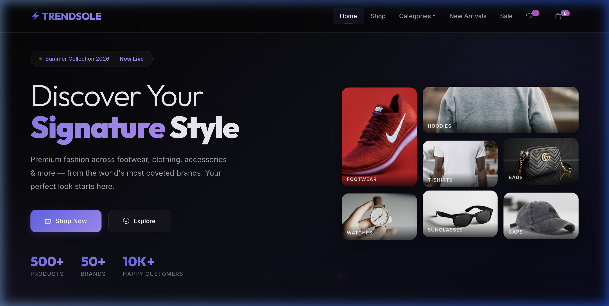
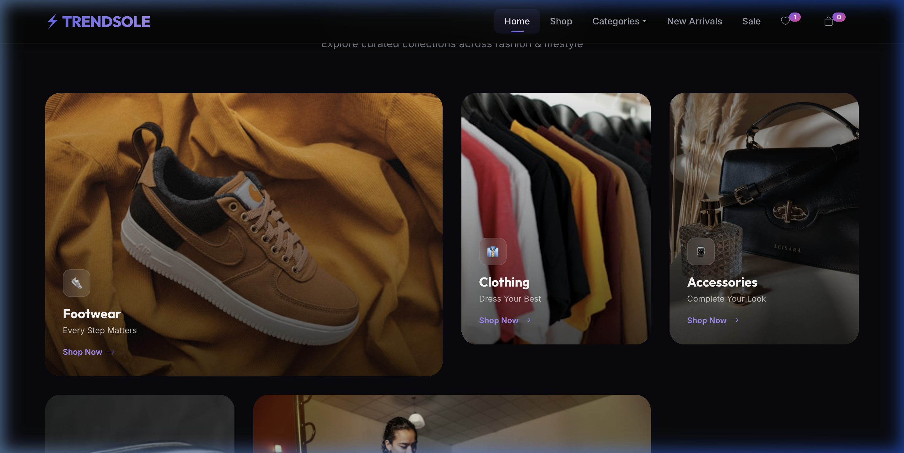
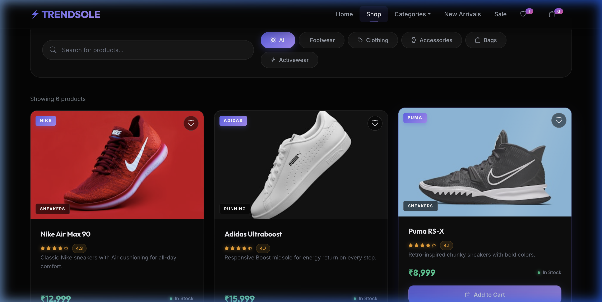
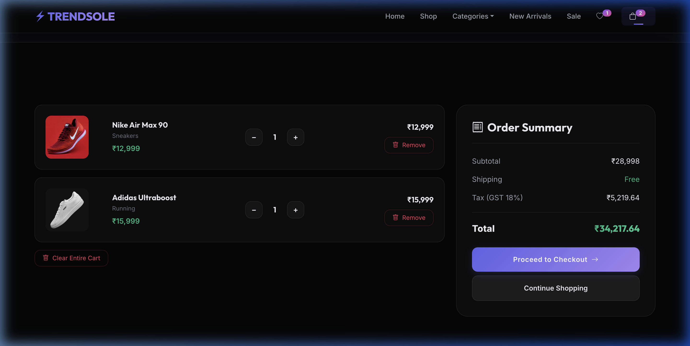
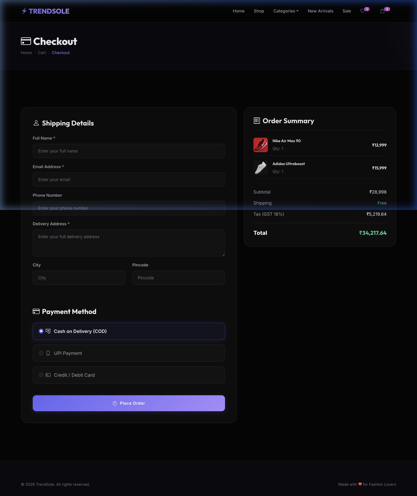

# ⚡ TrendSole — Premium E-Commerce Fashion Store

TrendSole is a high-end, responsive, and production-ready **E-Commerce Web Application** tailored specifically for luxury fashion retail. The project is powered by a robust **Java Spring Boot** REST API backend, **Spring Data JPA/Hibernate** ORM, and a **MySQL** or **in-memory H2 database**. The client side features a gorgeous, dark-themed storefront styled with **Vanilla CSS3**, custom **Outfit & Inter** Google Fonts, micro-animations, and glassmorphism layout components.

---

## 🚀 Features

### 💎 Frontend UI & Shopping Experience (Vanilla HTML5/CSS3/ES6)
*   **Editorial Typography & Visual Hierarchy**: Styled with tight editorial tracking (`letter-spacing: -0.04em`), contrasting light-and-bold Outfit typography weights, and generous spacing layout configurations.
*   **Dynamic Glassmorphic Product Cards**:
    *   Composited borders that glow purple-indigo on hover using `-webkit-mask` compositing rules.
    *   Subtle diagonal reflection sweeps across image wrappers on hover.
    *   Interactive stock status levels represented by glowing animated status dots (pulsing gold for low stock, solid emerald for in-stock, and rose for out-of-stock).
    *   Slide-up "Add to Cart" action buttons that slide up and fade in on hover, keeping card views clean on desktop viewports.
*   **Enhanced Category Capsules**: Luxury pill-styled buttons embedded with responsive Bootstrap Icons (👟, 👕, ⌚, etc.) that filter items instantly with smooth active states.
*   **Reimagined Search Box**: A transparent glass search field featuring a dynamic clear action button `(x)` that appears as you type to reset results instantly.
*   **Heartbeat Wishlist Interactions**:
    *   Heart toggle buttons with a heartbeat scale transition and drop-shadow rose glows on click.
    *   Direct heart links to a dedicated wishlist filtered view.
*   **Click-to-Select Payment Option Cards**: Checkout forms with transparent glass fields and custom selectable radio cards (COD, UPI, Credit Card) styled via modern CSS `:has()` parent selectors. Selecting a payment highlights the container in violet, expands it, and bolds the labels.
*   **Luxury Empty Cart Screen**: Clean shopping bag illustration with concentric pulsing rings (`empty-icon-pulse`) and premium call-to-actions.
*   **Loading State Skeletons**: Continuous left-to-right gradient sweep shimmers (`shimmer` keyframes) on loading placeholder cards.
*   **Page Load Transitions**: Smooth page entry slide-up and fade transitions (`pageFadeIn`) that animate main page wrappers dynamically when loaded.
*   **Ambient Star Ratings**: Gold rating stars styled with ambient gold drop-shadow glows and numeric values nested in glass badge pills.

### ⚙️ Backend REST API (Spring Boot & JPA)
*   **RESTful endpoints**: Structured APIs for the product catalog, cart operations, order placements, and historical queries.
*   **Data Persistence**: Built with Spring Data JPA & Hibernate, managing automated table schemas, data mappings, and validation rules.
*   **Automatic Database Synchronization**: Supports MySQL schema synchronization and seeds database rows with mock products automatically on startup.
*   **Flexible Profiles**: Configured with database profiles:
    *   `prod` profile runs an in-memory H2 database (great for isolated testing without setting up MySQL).
    *   `default` profile connects to local MySQL databases.
*   **Global CORS Configs**: Standardized configuration policies to support cross-origin queries.
*   **Exception handling**: Custom global handlers (e.g. `ResourceNotFoundException`) that return descriptive JSON error payloads.

---

## 🛠️ Tech Stack

*   **Backend Framework**: Java 21, Spring Boot 3.3.x (Web, JPA, DevTools)
*   **Database Engine**: MySQL 8.x / H2 Database (for in-memory runtime)
*   **ORM / Mapping**: Spring Data JPA & Hibernate
*   **Frontend Technologies**: HTML5, CSS3 (Vanilla), JavaScript (ES6+), Bootstrap 5 (Layout Grid structure)
*   **Utilities**: Lombok, Maven
*   **Icon Library**: Bootstrap Icons v1.11.x

---

## 📂 Project Structure

```text
Trendsole/
├── src/
│   ├── main/
│   │   ├── java/com/trendsole/
│   │   │   ├── config/             # CORS and Security configurations
│   │   │   ├── controller/         # REST Controllers (Product, Cart, Order)
│   │   │   ├── exception/          # Custom Exception handlers
│   │   │   ├── model/              # JPA Entities (Product, CartItem, Order)
│   │   │   ├── repository/         # JPA Repository Interfaces
│   │   │   ├── service/            # Core business logic layer
│   │   │   └── TrendSoleApplication.java # Spring Boot main startup class
│   │   └── resources/
│   │       ├── static/             # Frontend storefront assets (HTML, CSS, JS)
│   │       │   ├── css/            # Style sheets (style.css)
│   │       │   ├── js/             # Script files (app.js, products.js, cart.js, checkout.js)
│   │       │   ├── cart.html       # Storefront shopping cart view
│   │       │   ├── checkout.html   # Shipping details & payment options
│   │       │   ├── index.html      # Brand landing & home page
│   │       │   ├── products.html   # Shop list & filtered view
│   │       │   └── thankyou.html   # Post-purchase confirmation screen
│   │       ├── application.properties # Application settings & MySQL connection configs
│   │       └── schema.sql          # Predefined database schemas & mock seed data
├── Dockerfile                      # Docker container configurations
├── pom.xml                         # Maven dependencies & build configurations
└── README.md                       # Documentation
```

---

## 📡 API Endpoints

### 1. **Products API (`/api/products`)**
| HTTP Method | Endpoint | Description |
| :--- | :--- | :--- |
| **GET** | `/api/products` | Retrieve all products in the catalog |
| **GET** | `/api/products/{id}` | Retrieve details for a specific product |
| **GET** | `/api/products/category/{category}` | Filter products by category |
| **GET** | `/api/products/search?name={name}` | Search products by name (case-insensitive) |
| **POST** | `/api/products` | Create a new product |
| **PUT** | `/api/products/{id}` | Update product details |
| **DELETE** | `/api/products/{id}` | Delete a product from the database |

### 2. **Cart API (`/api/cart`)**
| HTTP Method | Endpoint | Description |
| :--- | :--- | :--- |
| **GET** | `/api/cart` | Retrieve current cart items |
| **POST** | `/api/cart/add?productId={id}&quantity={qty}` | Add or increment product in cart |
| **PUT** | `/api/cart/{id}?quantity={qty}` | Update cart item quantity |
| **DELETE** | `/api/cart/{id}` | Remove specific item from cart |
| **DELETE** | `/api/cart/clear` | Clear the shopping cart |
| **GET** | `/api/cart/total` | Calculate subtotal of all items |

### 3. **Orders API (`/api/orders`)**
| HTTP Method | Endpoint | Description |
| :--- | :--- | :--- |
| **GET** | `/api/orders` | View list of all orders |
| **GET** | `/api/orders/{id}` | Get specific order detail |
| **GET** | `/api/orders/email/{email}` | View orders history of a customer by email |
| **POST** | `/api/orders` | Place a new order |
| **DELETE** | `/api/orders/{id}` | Cancel/Delete an order |

---

## ⚙️ Setup & Installation

### **Prerequisites**
*   **Java JDK 21** or higher
*   **Maven 3.8+**
*   **MySQL Server** (optional if using H2 database profile)

---

### Option A: Running with MySQL (Default)

1. **Database Creation**:
   Open your MySQL command line client and execute:
   ```sql
   CREATE DATABASE ecommerce_db;
   ```
2. **Configuration**:
   Open `src/main/resources/application.properties` and fill in your connection credentials:
   ```properties
   spring.datasource.url=jdbc:mysql://localhost:3306/ecommerce_db?useSSL=false&serverTimezone=UTC
   spring.datasource.username=YOUR_MYSQL_USERNAME
   spring.datasource.password=YOUR_MYSQL_PASSWORD
   ```
3. **Execution**:
   Navigate to the project root directory and start the application:
   ```bash
   mvn spring-boot:run
   ```

---

### Option B: Running with In-Memory Database (Fast Run)

If you don't have MySQL installed, you can launch the application instantly using the **in-memory H2 database** profile:
```bash
mvn spring-boot:run -Dspring-boot.run.profiles=prod
```
The application will spin up, map tables, seed the DB, and run without requiring MySQL setup.

---

### Accessing the Storefront

Once the server logs show that the Tomcat instance is running on port `8080`, navigate to:
```text
http://localhost:8080
```
Browse products, add them to your cart, and place mock orders!

---

## 📸 Screenshots

| Page | View | Description |
| :--- | :--- | :--- |
| **Homepage** |  | Dark-themed landing page, typography pairings, and sliding product layout. |
| **Categories Grid** |  | Animated category selection filters with responsive icon backdrops. |
| **Product Shop** |  | Complete product catalog search filters and ambient star rating badges. |
| **Shopping Cart** |  | Dynamic quantity controller updates and cart count adjustments. |
| **Checkout Flow** |  | Checkout form entries and clickable payment radio click cards. |

---

## 🚀 Future Improvements

1.  **User Authentication & Security**: Integrate Spring Security and JWT to handle signup, customer login, and profiles.
2.  **Persistent Wishlist Storage**: Store wishlist selections in a database table tied to customer accounts instead of client memory.
3.  **Payment Gateway Integration**: Connect checkout fields to live payment APIs (e.g. Razorpay, Stripe) to support real-time digital payments.
4.  **Admin Dashboard**: Create an admin management screen to upload/edit products, track stock, and review order histories.

---

## 🧑‍💻 Author

*   **Namandeep Tripathi** — *Lead Developer & Architect*

---

## 📄 License

This project is licensed under the MIT License — see the [LICENSE](LICENSE) file for details.
